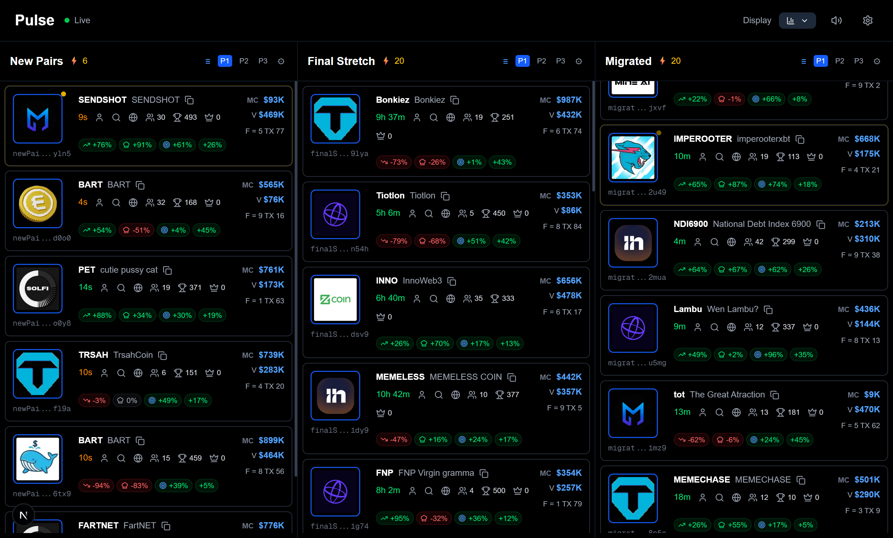
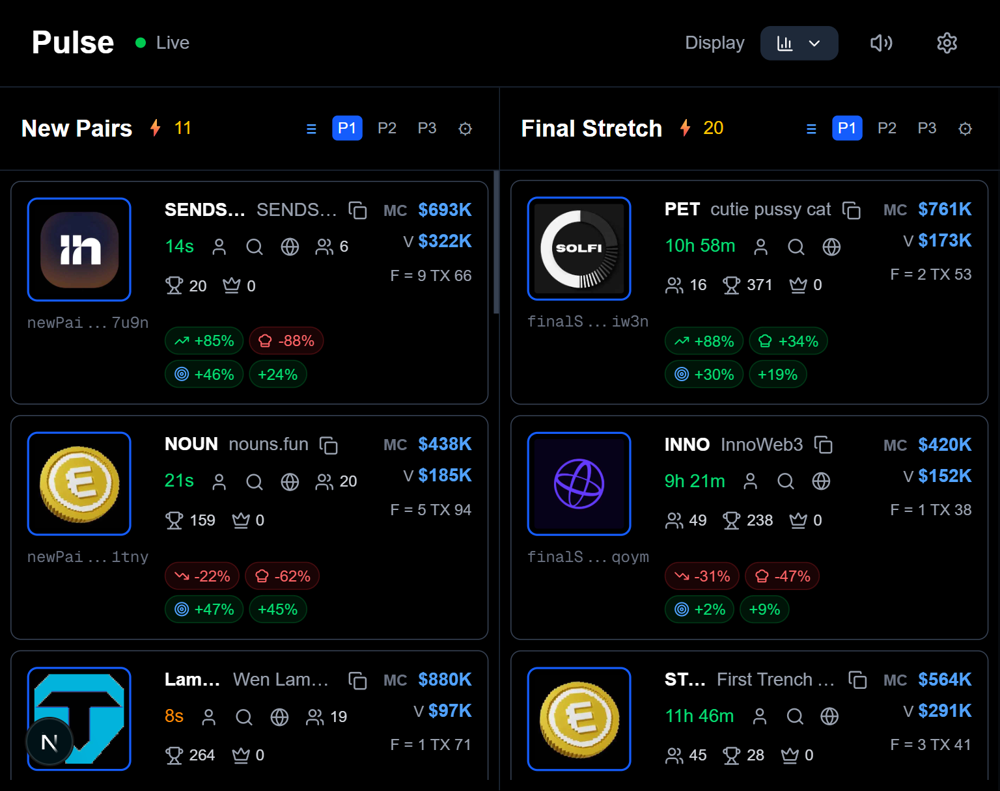
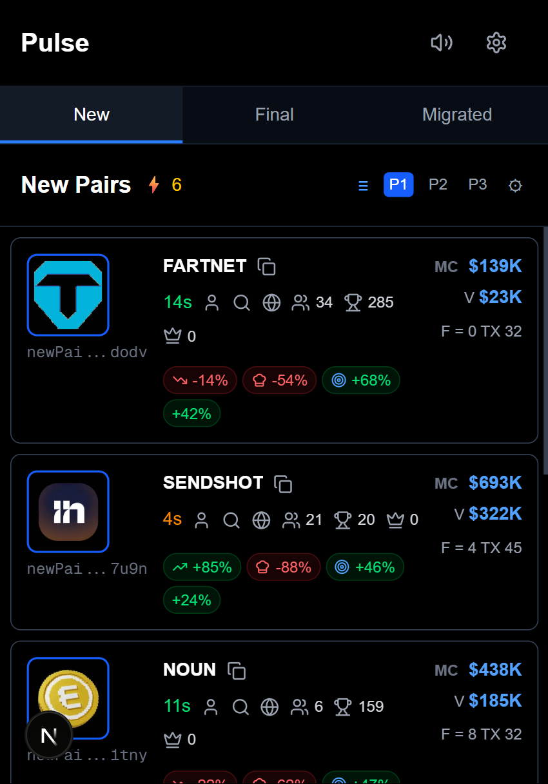
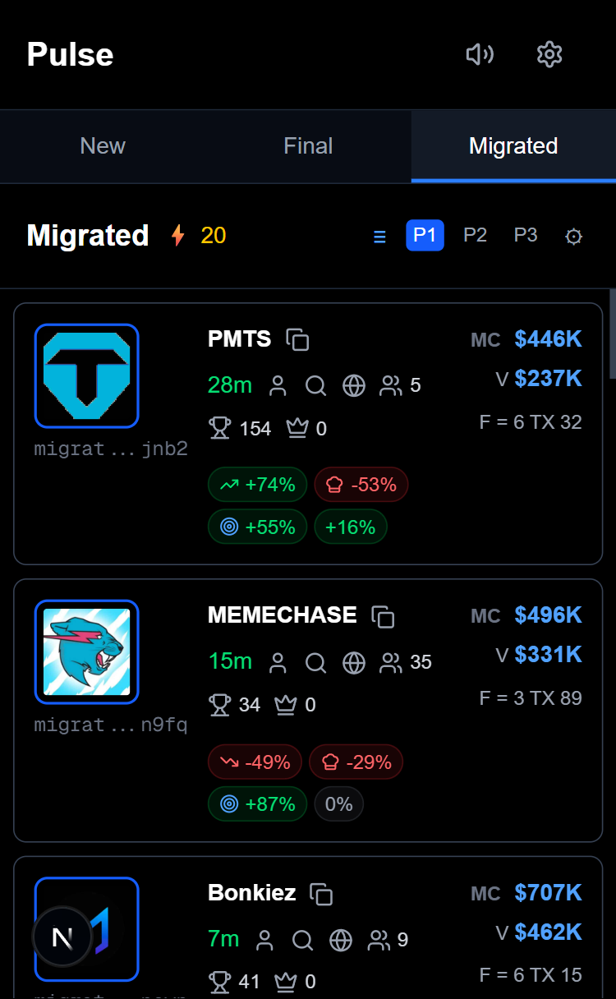

## 📱 Responsive Layout Snapshots

The application is fully responsive and works seamlessly from 320px to 4K displays.

### Desktop Views

*Desktop view at 1920px width*

  
*Desktop view at 1440px width*

### Tablet Views

*Tablet view at 768px width - 2 columns*

### Mobile Views

*Mobile view at 375px width - Tabbed interface*

*Mobile view at 320px width - Minimum supported width*

### Auto-Layout Features
- ✅ **3 columns** on desktop (1024px+)
- ✅ **2 columns** on tablet (768px-1023px)  
- ✅ **Tabbed interface** on mobile (<768px)
- ✅ **Minimum width**: 320px supported
- ✅ **Fluid typography** and spacing
- ✅ **Touch-friendly** interactions on mobile